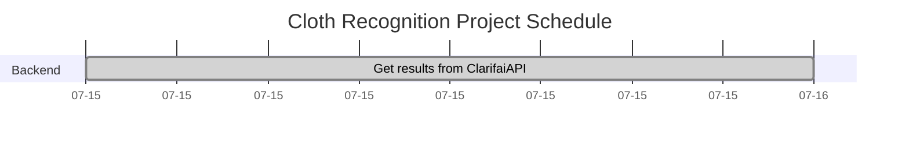

# Cloth Recognition App - BackEnd

A server has been setted up to scale this project to have profiles and be able to update profile information and show profile record. This will be implemented once the frontend is done and everything works smoothly.

### Server functionalities

- [x] Properly communicate with Clarifai API to get image data

#### After frontend completed
- [ ] Feature - SignIn / Register
- [ ] Save amount of images uploaded
- [ ] Save history of past 10 images
- [ ] Feature - update username/email

